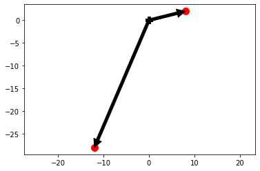
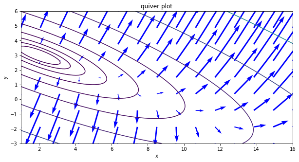

### Steps to get a gradient vector.      
- given equation: f(x,y) = $2x^2 + 6xy + 7y^2 -26x -54y + 107$
- first, cal with respect to x and y each. Then you will get a two derivative equations

\begin{equation}
    \nabla (f)= \begin{bmatrix}
4x+6y-26\\
6x+14y-54
\end{bmatrix}
\end{equation}

- second, choose the point where you want to get a slope each. Then apply the point.
    - x=7,y=1
        - then you will get an (8,2) which is a slope of each derevative. 
- at last, try to get a gradient vector by calculating the following : $\sqrt{8^2+2^2}$


```python
import numpy as np
import matplotlib.pylab as plt

black = {'facecolor':'black'}
def g(x,y):
    return (4*x+6*y-26, 6*x+14*y-54)
g1 = g(7,1)
g2 = g(2,1)

plt.plot(0,0,'kP',ms=10)
plt.plot(g1[0],g1[1],'ro',ms=10)
plt.annotate('',xy=g1,xytext=(0,0),arrowprops=black)
plt.plot(g2[0],g2[1],'ro',ms=10)
plt.annotate('',xy=g2,xytext=(0,0),arrowprops=black)

plt.axis('equal')
plt.show()
```





Following graph is to show the function : f(x,y) = $2x^2 + 6xy + 7y^2 -26x -54y + 107$


```python
def f(x,y):
    return 2*x**2+6*x*y+7*y**2-26*x-54*y+107
xx = np.linspace(1,16,100)
yy = np.linspace(-3,6,90)
X,Y = np.meshgrid(xx,yy)
Z=f(X,Y)

def gx(x,y):
    return 4*x+6*y-26
def gy(x,y):
    return 6*x+14*y-54

xx2 = np.linspace(1,16,15)
yy2 = np.linspace(-3,6,9)

X2, Y2 = np.meshgrid(xx2,yy2)
GX = gx(X2,Y2)
GY = gy(X2,Y2)
plt.figure(figsize = (10,5))
plt.contour(X,Y,Z, levels=np.logspace(0,3,10))
plt.quiver(X2, Y2, GX, GY, color='blue', scale=400, minshaft=2)

plt.xlabel('x')
plt.ylabel('y')
plt.title('quiver plot')
plt.show()
```





```python

```
